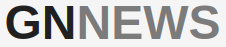

<a name="readme-top"></a>

<br />
<div align="center">
  <a href="https://github.com/github_username/repo_name">
    
  </a>

<h3 align="center">gnNews</h3>

  <p align="center">
    <strong>gnNews</strong> is an application that displays news.
    <br />
    <a href="https://github.com/sludwikowski/gnNewss"><strong>Explore the docs »</strong></a>
    <br />
    <br />
    <a href="https://github.com/sludwikowski/gnNewss">View Demo</a>
    ·
    <a href="https://github.com/sludwikowski/gnNewss/issues">Report Bug</a>
    ·
    <a href="https://github.com/sludwikowski/gnNewss/issues">Request Feature</a>
  </p>
</div>

<!-- TABLE OF CONTENTS -->
<details>
  <summary>Table of Contents</summary>
  <ol>
    <li>
      <a href="#about-the-project">About The Project</a>
      <ul>
        <li><a href="#built-with">Built With</a></li>
      </ul>
    </li>
    <li>
      <a href="#getting-started">Getting Started</a>
      <ul>
        <li><a href="#prerequisites">Prerequisites</a></li>
        <li><a href="#installation">Installation</a></li>
      </ul>
    </li>
    <li><a href="#roadmap">Roadmap</a></li>
    <li><a href="#contributing">Contributing</a></li>
    <li><a href="#contact">Contact</a></li>
  </ol>
</details>

<!-- ABOUT THE PROJECT -->

## About The Project

[![gnNews][product-screenshot]](/public/wiev.png)

<p align="right">(<a href="#readme-top">back to top</a>)</p>

### Built With

- [![Vite][Vite]][Vite-url]
- [![Typescript][Typescript]][Typescript-url]
- [![MUI][MUI]][MUI-url]

<p align="right">(<a href="#readme-top">back to top</a>)</p>

<!-- GETTING STARTED -->

## Getting Started

### Prerequisites

This is an example of how to list things you need to use the software and how to install them.

- npm
  ```sh
  npm install npm@latest -g
  ```
  or
  ```sh
  npm install -g pnpm
  ```

### Installation

1. Get a free API Key at [News API](https://newsapi.org/s/poland-news-api)
2. Clone the repo
   ```sh
     git clone git@github.com:sludwikowski/gnNewss.git
   ```
3. Install NPM packages

   ```sh
   npm install
   ```

   or

   ```sh
   pnpm install
   ```

4. Enter your API in `.env`

   ```js
   VITE_APP_KEY = 'YOUR_API_KEY'
   ```

5. Enter your API in `.env`
   ```js
   VITE_APP_KEY = 'YOUR_API_KEY'
   ```

<p align="right">(<a href="#readme-top">back to top</a>)</p>

<!-- ROADMAP -->

## Roadmap

- [x] Create Layout
  - [x] Adding Navbar
    - [x] Adding Application name
    - [x] Adding a toggle button for switching between list and grid view in the application
    - [x] Adding Popup
  - [x] Adding SideMenu
    - [x] Adding a list of countries
    - [x] Adding a flag to the view
  - [x] Add MainContent
    - [x] Adding a list or tile view for news articles
    - [x] Adding a popup with its content, as well as the author and the URL of the source from which the news was fetched.
  - [x] Adding Footer
- [x] Fetch News from NewsAPi
- [x] Adding a ReduxToolkit
- [x] Refactoring application
- [x] Adding a tests

See the [open issues](hhttps://github.com/sludwikowski/gnNewss/issues) for a full list of proposed features (and known issues).

<p align="right">(<a href="#readme-top">back to top</a>)</p>

<!-- CONTRIBUTING -->

## Contributing

Contributions are what make the open source community such an amazing place to learn, inspire, and create. Any contributions you make are **greatly appreciated**.

If you have a suggestion that would make this better, please fork the repo and create a pull request. You can also simply open an issue with the tag "enhancement".
Don't forget to give the project a star! Thanks again!

1. Fork the Project
2. Create your Feature Branch (`git checkout -b feature/AmazingFeature`)
3. Commit your Changes (`git commit -m 'Add some AmazingFeature'`)
4. Push to the Branch (`git push origin feature/AmazingFeature`)
5. Open a Pull Request

<p align="right">(<a href="#readme-top">back to top</a>)</p>

<!-- CONTACT -->

## Contact

@sludwikowski - [@sludwikowski](https://www.linkedin.com/in/sludwikowski/) - sludwikowski.dev@gmail.com

Project Link: [https://github.com/sludwikowski/personal-blog](https://github.com/sludwikowski/gnNewss)

<p align="right">(<a href="#readme-top">back to top</a>)</p>

<!-- MARKDOWN LINKS & IMAGES -->
<!-- https://www.markdownguide.org/basic-syntax/#reference-style-links -->

[contributors-shield]: https://img.shields.io/github/contributors/github_username/repo_name.svg?style=for-the-badge
[contributors-url]: https://github.com/sludwikowski/personal-blog/graphs/contributors
[forks-shield]: https://img.shields.io/github/forks/github_username/repo_name.svg?style=for-the-badge
[forks-url]: https://github.com/sludwikowski/personal-blog/network/members
[stars-shield]: https://img.shields.io/github/stars/github_username/repo_name.svg?style=for-the-badge
[stars-url]: https://github.com/sludwikowski/personal-blog/stargazers
[issues-shield]: https://img.shields.io/github/issues/github_username/repo_name.svg?style=for-the-badge
[issues-url]: https://github.com/sludwikowski/personal-blog/issues
[license-shield]: https://img.shields.io/github/license/github_username/repo_name.svg?style=for-the-badge
[license-url]: https://github.com/sludwikowski/personal-blog/blob/master/LICENSE.txt
[linkedin-shield]: https://img.shields.io/badge/-LinkedIn-black.svg?style=for-the-badge&logo=linkedin&colorB=555
[linkedin-url]: https://www.linkedin.com/in/sludwikowski/
[product-screenshot]: /public/wiev.png
[Vite]: https://img.shields.io/badge/Vite-F1f1f1?style=for-the-badge&logo=Vite&
[Vite-url]: https://vitejs.dev/
[MUI]: https://img.shields.io/badge/MaterialUi-blue?style=for-the-badge
[MUI-url]: https://mui.com/material-ui/getting-started/installation/
[Next.js]: https://img.shields.io/badge/next.js-000000?style=for-the-badge&logo=nextdotjs&logoColor=white
[Next-url]: https://nextjs.org/
[TypeScript]: https://img.shields.io/badge/typescript-3178C6?style=for-the-badge&logo=typescript&logoColor=white
[TypeScript-url]: https://www.typescriptlang.org/
[Sanity]: https://img.shields.io/badge/sanity-F79E97?style=for-the-badge&logo=sanity&logoColor=white
[sanity-url]: https://sanity.io/
[TailwindCSS]: https://img.shields.io/badge/tailwindcss-38BDF8?style=for-the-badge&logo=tailwindcss&logoColor=white
[tailwind-url]: https://tailwindcss.com/

<!-- GETTING STARTED -->
